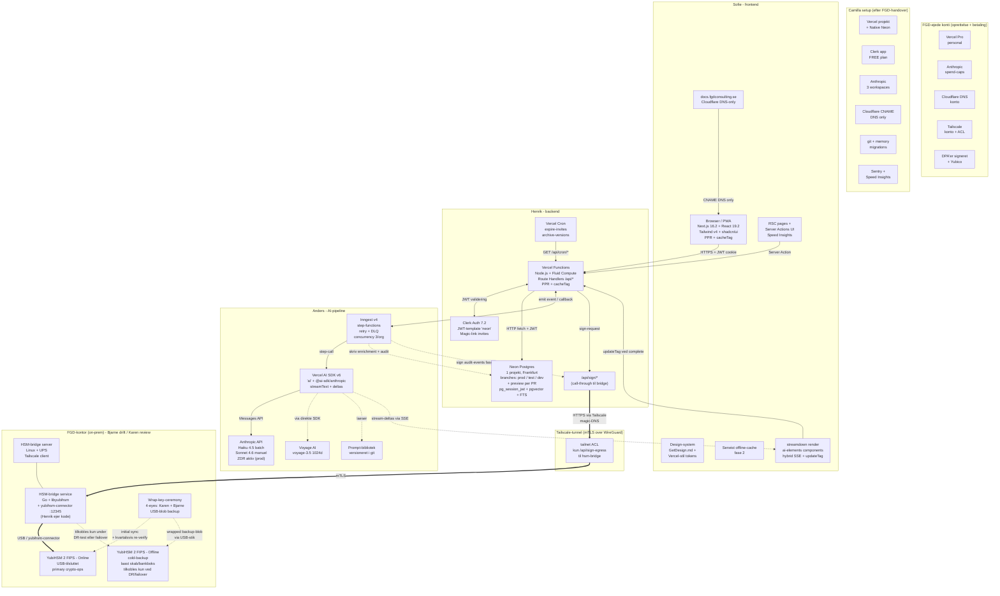

# Knowlagecentral v3 — Analyse

Brief: `Team Inbox/projects/knowlagecentral/2026-05-05-knowlagecentral-evernote-style.md`
Standarder: `/Users/fgd/.claude/CLAUDE.md` (OWASP API Top 10, RFC 9457, OpenAPI 3.1, OpenTelemetry)
Arkitektur-diagram: `Team/Poul/2026-05-05-knowlagecentral-arkitektur.excalidraw`

## 1. Sammendrag

Vi bygger en multi-tenant Evernote-lignende knowlagecentral på Next.js 16.2 + React 19.2 + Neon Postgres (Frankfurt) + Clerk 7.2. Frontend er PWA-installerbar; primær desktop-redigering, mobil read-mostly. Notebooks deles med kunder via magic-link-invites; subteam-modellen er designet i v1 og aktiveres i fase 2. AI-berigelse (titel, resumé, tags, embeddings, foreslåede notebook-tilknytninger) kører asynkront via Inngest v4 + Vercel AI SDK v6 mod Anthropic Haiku 4.5 (batch) og Sonnet 4.6 (manuel raffinering). Søgning starter som Postgres FTS (tsvector) og bliver hybrid (FTS + pgvector + RRF) i fase 2.

Hosting er Vercel Pro (personal account, Node.js + Fluid Compute — eksplicit ingen Edge runtime) + Neon via Vercel Native Integration: ÉT Neon-projekt med tre long-lived named branches (`prod`, `test`, `dev`) plus auto-provisionerede `preview/<branch>`-branches pr. PR. Cloudflare DNS leverer CNAME for `docs.fgdconsulting.se` med "DNS only" proxy-status. Observability er Sentry (errors) + Vercel Speed Insights (Web Vitals, $10/md).

Sikkerheden står på defense-in-depth: Clerk JWT (RS256, alg-pinned) + eksplicit API-lag-check + Neon RLS Authorize via `pg_session_jwt` + Zod `.strict()` mod BOPLA. AI-budgettet på 500 DKK/md (~70 USD) holdes via per-workspace spend-caps og Inngest concurrency på 3 jobs/organisation. Kunder kan opt-out af AI-berigelse pr. notebook (GDPR), Anthropic Zero Data Retention er aktiveret på prod-workspace, og databehandleraftaler tabel-tracker pr. leverandør (Neon, Vercel, Clerk, Anthropic, Inngest, Voyage). Estimeret tidsplan: 5–7 uger fra rolle-ansættelse til fase 2-launch.

## 2. Behovs-analyse

### Aktører

| Aktør | Beskrivelse |
|---|---|
| FGD (ejer) | Opretter notebooks og noter, importerer txt-batches, raffinerer AI-output, søger på tværs, opretter kunder manuelt, signerer DPA'er |
| Kunde-bruger (ekstern) | Inviteret via magic-link til ét eller flere notebooks; rolle viewer/editor/admin; ses kun det de har adgang til |
| Subteam (fase 2) | Flere personer fra samme kunde-organisation, tilknyttet via `organization_members` |
| System (AI-worker) | Berigelses-jobs trigget ved import + ændring; producerer titel, resumé, tags, foreslåede notebook-tilknytninger, embeddings |

### Primære brugerflows

1. **Opret note manuelt** — auto-save + debounced version-snapshot; berigelses-job triggres ved første save og ved akkumulerede ændringer over tærskel.
2. **Importér txt-batch** — drop-zone (HTML5 `webkitdirectory`) eller CLI; alle filer landes i "Inbox"-notebook (`status='imported'`); berigelses-jobs spawnes batch-vis; AI foreslår notebook-tildeling.
3. **AI-raffinering** — pr.-felt accept/edit/reject for titel, resumé, tags; manuel "kør berigelse igen"-knap.
4. **Global søgning** — på tværs af notebooks brugeren har adgang til (direkte membership eller via organisation); filtre på notebook/tags/dato; snippet med highlight.
5. **Del notebook med kunde** — FGD inviterer email + rolle; magic-link genereres; kunden logger ind, ser kun det delte.
6. **Mobil read-mostly** — slå op + quick-note; fuld redigering desktop-først.
7. **Subteam-organisering (fase 2)** — kunde-admin tilknytter team-medlemmer; tildeler notebooks til subteam.

### Use cases

- UC-01 Opret notebook (ejer eller organisation-admin)
- UC-02 Opret/rediger/slet note
- UC-03 Importér txt-batch → Inbox-notebook
- UC-04 Auto-berigelse (opt-out pr. notebook)
- UC-05 Manuel raffinering + accept-flow
- UC-06 Global søgning (FTS i MVP, hybrid i fase 2)
- UC-07 Del notebook + roller via magic-link
- UC-08 Versions-historik + diff + rollback (debounced)
- UC-09 Eksportér notebook (markdown-zip)
- UC-10 Audit-log pr. organisation
- UC-11 [Fase 2] Opret organisation + invitér members
- UC-12 [Fase 2] Subteam-styring inden for organisation

### Ikke-funktionelle krav

| Krav | Mål |
|---|---|
| Sikkerhed | OWASP API Top 10 compliance; BOLA umuligt pga. RLS + API-tjek; alle writes idempotente; secrets via Vercel env / Native Integration |
| Performance | P95 < 300 ms for liste/søg op til 50k noter; cold-start tolerable (<1s) på Fluid Compute |
| Mobil | Responsivt UI, PWA installerbar, offline-cache for noter besøgt seneste 7 dage (fase 2 via Serwist) |
| Tilgængelighed | 99.5% (Vercel + Neon SLA) |
| Observability | OpenTelemetry traces; struktur-logs uden PII; Sentry errors; Speed Insights Web Vitals |
| GDPR | Opt-out AI per notebook; data-export pr. organisation; slet-konto flow; DPA'er pr. leverandør |
| Data-residency | EU (Frankfurt eu-central-1); encryption-at-rest |
| Kost-loft | < 500 DKK/md (~70 USD) for AI; < ~$50/md infrastructure |

## 3. Arkitektur

### 3.1 Komponent-oversigt (Mermaid)



### 3.2 Rolle-ejerskab pr. komponent (tabel)

| Komponent | Niveau | Ejer-rolle | Kommentar |
|---|---|---|---|
| Vercel Pro konto | konto | FGD | Personal account; månedligt $20 |
| Anthropic konto + spend-caps | konto | FGD | $50 prod / $15 test / $5 dev workspace caps |
| Cloudflare konto | konto | FGD | DNS-only mode |
| DPA-signering | compliance | FGD | Neon, Vercel, Clerk, Anthropic, Inngest, Voyage |
| Vercel projekt + Native Neon Integration | infra-setup | Camilla | Aktivér "Required → Preview" toggle |
| Clerk app (FREE plan) | infra-setup | Camilla | JWT-template "neon" konfigureres |
| Anthropic 3 workspaces | infra-setup | Camilla | ZDR-flag på prod-workspace |
| Cloudflare CNAME-record | infra-setup | Camilla | `docs` → `cname.vercel-dns.com`, proxy OFF |
| git-repo + memory-mappe | infra-setup | Camilla | Konventioner i `Team/_konventioner.md` |
| Drizzle migrations execution | DB-ops | Camilla | dev → test → prod gating |
| Sentry projekt | infra-setup | Camilla | Free tier MVP |
| Vercel Speed Insights | infra-setup | Camilla | $10/md |
| Browser/PWA shell | frontend | Sofie | Next.js 16.2 + Tailwind v4 + shadcn/ui |
| RSC pages + Server Actions UI | frontend | Sofie | Node.js runtime, IKKE Edge |
| Design-system (GetDesign.md + tokens) | frontend | Sofie | Vercel-stil baseline |
| Serwist offline-cache | frontend (fase 2) | Sofie | PWA installation |
| Speed Insights mount | frontend | Sofie | `app/layout.tsx` |
| Custom domain wire-up i Vercel | frontend | Sofie | Efter Camillas DNS-record |
| Vercel Functions / Route Handlers | backend | Henrik | OpenAPI 3.1 contract |
| Drizzle 0.45.2 schema | backend | Henrik | Schema-design + migrations-design |
| Neon RLS-policies | backend | Henrik | pg_session_jwt + Authorize |
| Clerk JWT-template integration | backend | Henrik | `iss/aud/exp/nbf` validering |
| Vercel Cron jobs | backend | Henrik | `vercel.json` `crons` + signed user-agent |
| Idempotency + RFC 9457 errors | backend | Henrik | `Idempotency-Key` header på writes |
| OpenAPI lint (Spectral) i CI | backend | Henrik | Inkl. `/api/cron/*` |
| Inngest v4 functions | AI-pipeline | Anders | step-functions, retry, DLQ |
| Vercel AI SDK v6 integration | AI-pipeline | Anders | `ai` + `@ai-sdk/anthropic` |
| Voyage-3.5 embedding-pipeline | AI-pipeline | Anders | Direkte SDK, 1024-dim |
| Prompt-bibliotek (versioneret) | AI-pipeline | Anders | Git-versioneret, prompt-version logges på enrichments |
| Spend-cap håndtering + alarmering | AI-pipeline | Anders | Fail-soft når cap er nået |
| Anthropic ZDR-konfiguration | AI-pipeline | Anders | Verificér før prod-launch |
| Tailscale-konto + ACL | infra-konto | FGD (konto), Bjarne (drift) | Free tier MVP; Business når ACL vokser |
| HSM-bridge service (kode) | backend | Henrik | Go + libyubihsm; Karen secure-code-review før deploy |
| HSM-bridge deployment + drift | infra-ops | Camilla (deployer), Bjarne (drift) | Systemd unit på FGD-kontor host |
| YubiHSM 2 FIPS — Online | hardware/HSM | Bjarne (drift), Karen (review) | USB-tilsluttet bridge-server; primær crypto |
| YubiHSM 2 FIPS — Offline (cold-backup) | hardware/HSM | Bjarne (DR-tests), Karen (review) | Låst skab/bankboks; kvartalsvise DR-tests |
| Wrap-key-ceremony + export-procedure | crypto-ops | Bjarne (eksekverer), Karen (designer + 4-eyes) | Initial + halvårlig + post-incident |
| HSM-host server (FGD-kontor) | hardware/infra | FGD (hardware + UPS), Bjarne (drift) | Linux; Tailscale client + bridge service |

### 3.3 Data-flow: import + auto-berigelse

```
1. Bruger uploader 50 txt-filer (multipart) -> Route Handler /api/import
   - Idempotency-Key obligatorisk; Zod .strict() validerer body
2. Henriks Route Handler (auth ✓, kvote ✓, org-medlemskab ✓) opretter i én tx:
   - app.notes (notebook_id = "Inbox", status='imported')
   - app.enrichment_jobs (status='queued', organization_id)
   Returnerer 202 Accepted med job-ID-liste
3. Route Handler emit'er Inngest event 'note/enrichment.requested' pr. note
4. Inngest worker callback til /api/inngest (Node.js runtime):
   step 1: hent note + tjek notebook.ai_enrichment_enabled (RLS-bypass via service-role)
   step 2: hvis enabled -> AI SDK v6 streamText med Haiku 4.5 (titel + resumé + tags + foreslåede notebooks)
   step 3: Voyage-3.5 embedding (direkte SDK)
   step 4: skriv app.note_enrichments + app.note_embeddings; markér job 'done'
   step 5: Frontend modtager via SSE `/api/jobs/stream` partial AI-tokens (titel, resumé). **Streamdown** renderer progressivt — håndterer halv-streamede markdown-fences uden flicker. Inngest worker step `notify_frontend` kalder Server Action `revalidateNote(noteId)` der wrapper `updateTag('note:'+noteId)` + `updateTag('notebook:'+notebookId+':notes')`. Dette erstatter polling for "AI færdig"-state.
```

### 3.4 Data-flow: read (søgning)

```
Browser -> RSC page /search?q=foo
  -> Server Component dekoreres med 'use cache' + cacheTag('user:'+userId+':notebooks')
  -> kalder DB med Clerk JWT (Neon HTTP driver)
  -> Postgres pg_session_jwt validerer JWT; RLS filtrerer rows til
     notebooks brugeren er medlem af ELLER organisationer brugeren er medlem af
  -> MVP: tsvector match + ts_rank_cd
     Fase 2: hybrid (tsvector + pgvector cosine, RRF) -> top 20
  -> JSX med snippet + highlight
  -> updateTag(...) ved any write invaliderer søge-cache
```

### 3.6 Monorepo-struktur (turborepo)

Vi bruger turborepo fra dag 1. Struktur:

```
knowlagecentral/                              ← turborepo root
├── apps/
│   ├── web/                            ← Next.js 16.2 App Router (Sofie + Henrik)
│   └── cli/                            ← Node.js import-CLI (Henrik)
├── packages/
│   ├── db/                             ← Drizzle schema + migrations (Henrik + Camilla)
│   ├── ai/                             ← Prompt-bibliotek + AI-helpers (Anders)
│   ├── zod-contracts/                  ← Delte Zod-skemaer mellem web + cli
│   └── ui/                             ← Delte shadcn-komponenter (Sofie) — overvej fase 2
├── turbo.json                          ← task pipeline config
├── pnpm-workspace.yaml                 ← pnpm-workspaces (anbefalet over npm)
└── package.json                        ← root workspace

knowlagecentral-hsm-bridge/                   ← SEPARAT repo (Go, ikke TypeScript)
                                          Bjarne deployer; Karen review'er
```

**Hvorfor turborepo nu** (FGD-beslutning 2026-05-05): én git-historie for web + CLI + delte contracts. `--filter`/`--affected` reducerer CI-tid når kun én pakke ændres. `apps/web` deler `packages/zod-contracts` med `apps/cli` så API-kontrakter er konsistente.

**Hvorfor Go-bridge separat**: turbo orkestrerer ikke Go-pipelines. Bjarne deployer bridge-service som standalone systemd-unit; den taler med web via mTLS over Tailscale.

### 3.5 HSM-arkitektur (Layer 2: online + offline)

**Strategisk mål**: FGD har bestilt 2× YubiHSM 2 FIPS i Layer 2-konfiguration (online + offline) med eksplicit forventning om at **FIPS 140-3 cert godkendes og anvendes i produktion**. Vi udvikler ikke "best practices med FIPS-aware design" — vi udvikler med produktions-FIPS 140-3 compliance som målbillede. Cert-status (Yubico's FIPS 140-3 valideringsproces forventes Q2 2026) er en planlagt milestone, ikke en åben risiko. Karen sikrer at design + dokumentation matcher det formelle cert-niveau når det udstedes.

**MVP-tilstand (fase 1)**: Non-FIPS YubiHSM 2 v2.4 (€728, tilgængelig nu) på FGD-kontor, USB-tilsluttet bridge-server, access via Tailscale-tunnel. Magic-link invite-signing blokerer IKKE fase 1-launch; HSM-integration starter fase 1.5 efter hardware-ankomst + Karen threat-model + Bjarne key-ceremony.

#### Online HSM (primær)

- **Hardware**: YubiHSM 2 FIPS (fase 1.5+) eller non-FIPS v2.4 (fase 1)
- **Placering**: FGD-kontor, USB-tilsluttet bridge-server (Tailscale client + systemd service)
- **Crypto-ops**: HMAC-SHA256 invite-token signing (fase 1.5), field-level encryption + audit-log signing (fase 2)
- **Reliability**: UPS-backed (min. 2 timer); Sentry alarm på connection-failure
- **Key-ceremony**: Initial wrap-key-generation (Karen + Bjarne, 4-eyes), semi-årlig rotation

#### Offline HSM (cold-backup)

- **Hardware**: Identical YubiHSM 2 FIPS (fase 2+ når kunde betaler)
- **Placering**: Låst skab eller bankboks; aldrig tilsluttet netværk
- **Rolle**: Disaster recovery + wrap-key-backup (krypteret USB-blob)
- **Activation**: Kun ved DR-test (kvartalsvis) eller failover; Bjarne + Karen anbefaling før aktivering
- **Dokumentation**: Export-procedure i Karen's runbook; seed-phrase backup i fysisk vault

#### Wrap-key-synkronisering

- **Initial**: Karen designer; Bjarne eksekver 4-eyes ceremony ved HSM-installation
- **Backup**: Krypteret wrap-key-blob eksporteret til USB-stik, opbevaret separat fra HSM'erne
- **Rotation**: Semi-årlig eller post-security-event; procedure i Karen's runbook
- **Failover-test**: Restore fra backup til offline HSM; quarterly; Bjarne rapporterer til Karen

#### Failover-flow

1. Online HSM CONNECTION-ERROR i bridge-service → Sentry alert
2. Bjarne kalder Karen; Karen vurderer: temporary vs. permanent failure
3. Hvis permanent: Karen anbefaler failover; Bjarne aktiverer offline HSM (fysisk USB)
4. Bridge-service redirects sign-requests til offline-enheden
5. Post-incident: wrap-key-rekey + security-review (Karen + Henrik secure-code-review)

#### DR-test-kadence

- **Quarterly** (hver 3. måned): Simuleret failover til offline HSM
- **Procedure**: Karen's runbook-step; Bjarne eksekverer; Henrik bridge-service-test
- **Dokumentation**: Execution-log + remediation-notes i Team/Bjarne/
- **Success-criteria**: Sign-request latency < 200ms via offline; no data loss; rollback-reverify via online

**Cost & timeline**:
- Fase 1 (non-FIPS MVP): €778 engangs (HSM + USB-kabel)
- Fase 1.5 (HSM online): Karen threat-model (3–5 dage) + Bjarne key-ceremony (~1 dag)
- Fase 2 (failover): €1.187,50 × 2 FIPS-enheder + Hetzner colocation-setup (~5 dage engineering)

## 4. Datamodel

Schema: `app` (forretning), `audit` (events), `sys` (DPA'er + ops). PK'er er UUIDv7 (tidssorterbar, opaque).

```sql
-- USERS (synced fra Clerk webhook)
CREATE TABLE app.users (
  id              UUID PRIMARY KEY DEFAULT uuidv7(),
  clerk_user_id   TEXT UNIQUE NOT NULL,
  email           CITEXT UNIQUE NOT NULL,
  display_name    TEXT,
  created_at      TIMESTAMPTZ NOT NULL DEFAULT now(),
  updated_at      TIMESTAMPTZ NOT NULL DEFAULT now()
);
CREATE INDEX users_clerk_idx ON app.users (clerk_user_id);

-- ORGANISATIONS (tenant isolation)
CREATE TABLE app.organizations (
  id              UUID PRIMARY KEY DEFAULT uuidv7(),
  owner_id        UUID NOT NULL REFERENCES app.users(id) ON DELETE RESTRICT,
  name            TEXT NOT NULL,
  ai_enrichment_enabled BOOLEAN NOT NULL DEFAULT true,
  created_at      TIMESTAMPTZ NOT NULL DEFAULT now(),
  updated_at      TIMESTAMPTZ NOT NULL DEFAULT now()
);
CREATE INDEX orgs_owner_idx ON app.organizations (owner_id);

CREATE TABLE app.organization_members (
  organization_id UUID NOT NULL REFERENCES app.organizations(id) ON DELETE CASCADE,
  user_id         UUID NOT NULL REFERENCES app.users(id) ON DELETE CASCADE,
  role            TEXT NOT NULL DEFAULT 'member',
  invited_by      UUID REFERENCES app.users(id),
  invited_at      TIMESTAMPTZ NOT NULL DEFAULT now(),
  accepted_at     TIMESTAMPTZ,
  PRIMARY KEY (organization_id, user_id)
);
CREATE INDEX orgm_user_idx ON app.organization_members (user_id);

CREATE TABLE app.organization_invites (
  id              UUID PRIMARY KEY DEFAULT uuidv7(),
  organization_id UUID NOT NULL REFERENCES app.organizations(id) ON DELETE CASCADE,
  email           CITEXT NOT NULL,
  role            TEXT NOT NULL DEFAULT 'member',
  token_hash      TEXT NOT NULL UNIQUE,
  expires_at      TIMESTAMPTZ NOT NULL DEFAULT now() + INTERVAL '7 days',
  invited_by      UUID NOT NULL REFERENCES app.users(id),
  invited_at      TIMESTAMPTZ NOT NULL DEFAULT now(),
  consumed_at     TIMESTAMPTZ
);
CREATE INDEX orginv_email_idx ON app.organization_invites (email) WHERE consumed_at IS NULL;

-- NOTEBOOKS
CREATE TABLE app.notebooks (
  id              UUID PRIMARY KEY DEFAULT uuidv7(),
  owner_id        UUID NOT NULL REFERENCES app.users(id) ON DELETE RESTRICT,
  organization_id UUID REFERENCES app.organizations(id) ON DELETE CASCADE,
  name            TEXT NOT NULL,
  description     TEXT,
  ai_enrichment_enabled BOOLEAN NOT NULL DEFAULT true,
  is_inbox        BOOLEAN NOT NULL DEFAULT false,
  archived_at     TIMESTAMPTZ,
  created_at      TIMESTAMPTZ NOT NULL DEFAULT now(),
  updated_at      TIMESTAMPTZ NOT NULL DEFAULT now()
);
CREATE INDEX notebooks_owner_idx ON app.notebooks (owner_id) WHERE archived_at IS NULL;
CREATE INDEX notebooks_org_idx   ON app.notebooks (organization_id) WHERE archived_at IS NULL;
CREATE UNIQUE INDEX notebooks_inbox_per_user
  ON app.notebooks (owner_id) WHERE is_inbox = true AND archived_at IS NULL;

CREATE TYPE app.notebook_role AS ENUM ('owner','editor','viewer');

CREATE TABLE app.notebook_members (
  notebook_id     UUID NOT NULL REFERENCES app.notebooks(id) ON DELETE CASCADE,
  user_id         UUID NOT NULL REFERENCES app.users(id) ON DELETE CASCADE,
  role            app.notebook_role NOT NULL,
  invited_by      UUID REFERENCES app.users(id),
  invited_at      TIMESTAMPTZ NOT NULL DEFAULT now(),
  accepted_at     TIMESTAMPTZ,
  PRIMARY KEY (notebook_id, user_id)
);
CREATE INDEX nbm_user_idx ON app.notebook_members (user_id);

CREATE TABLE app.notebook_invites (
  id              UUID PRIMARY KEY DEFAULT uuidv7(),
  notebook_id     UUID NOT NULL REFERENCES app.notebooks(id) ON DELETE CASCADE,
  email           CITEXT NOT NULL,
  role            app.notebook_role NOT NULL,
  token_hash      TEXT NOT NULL UNIQUE,
  expires_at      TIMESTAMPTZ NOT NULL DEFAULT now() + INTERVAL '7 days',
  invited_by      UUID NOT NULL REFERENCES app.users(id),
  invited_at      TIMESTAMPTZ NOT NULL DEFAULT now(),
  consumed_at     TIMESTAMPTZ
);
CREATE INDEX invites_email_idx ON app.notebook_invites (email) WHERE consumed_at IS NULL;

-- NOTES (FTS via generated tsvector)
CREATE TABLE app.notes (
  id              UUID PRIMARY KEY DEFAULT uuidv7(),
  notebook_id     UUID NOT NULL REFERENCES app.notebooks(id) ON DELETE CASCADE,
  created_by      UUID NOT NULL REFERENCES app.users(id),
  title           TEXT,
  body_md         TEXT NOT NULL DEFAULT '',
  body_search     TSVECTOR GENERATED ALWAYS AS
                    (to_tsvector('simple',
                       coalesce(title,'') || ' ' || coalesce(body_md,'')))
                    STORED,
  ai_enrichment_enabled BOOLEAN NOT NULL DEFAULT true,
  status          TEXT NOT NULL DEFAULT 'draft',
  source          TEXT,
  created_at      TIMESTAMPTZ NOT NULL DEFAULT now(),
  updated_at      TIMESTAMPTZ NOT NULL DEFAULT now()
);
CREATE INDEX notes_notebook_idx ON app.notes (notebook_id, updated_at DESC);
CREATE INDEX notes_search_idx   ON app.notes USING GIN (body_search);

-- VERSIONS (debounced: 30s inaktivitet ELLER 200 char akkumuleret diff)
CREATE TABLE app.note_versions (
  id              UUID PRIMARY KEY DEFAULT uuidv7(),
  note_id         UUID NOT NULL REFERENCES app.notes(id) ON DELETE CASCADE,
  body_md_compressed BYTEA NOT NULL,
  title           TEXT,
  edited_by       UUID NOT NULL REFERENCES app.users(id),
  edited_at       TIMESTAMPTZ NOT NULL DEFAULT now(),
  debounce_count  INT NOT NULL DEFAULT 1
);
CREATE INDEX nv_note_time_idx ON app.note_versions (note_id, edited_at DESC);

-- TAGS
CREATE TABLE app.tags (
  id              UUID PRIMARY KEY DEFAULT uuidv7(),
  owner_id        UUID NOT NULL REFERENCES app.users(id),
  name            CITEXT NOT NULL,
  UNIQUE (owner_id, name)
);

CREATE TYPE app.tag_source AS ENUM ('user','ai_suggested','ai_accepted');

CREATE TABLE app.note_tags (
  note_id         UUID NOT NULL REFERENCES app.notes(id) ON DELETE CASCADE,
  tag_id          UUID NOT NULL REFERENCES app.tags(id) ON DELETE CASCADE,
  source          app.tag_source NOT NULL DEFAULT 'user',
  PRIMARY KEY (note_id, tag_id)
);

-- ENRICHMENTS
CREATE TABLE app.note_enrichments (
  id              UUID PRIMARY KEY DEFAULT uuidv7(),
  note_id         UUID NOT NULL REFERENCES app.notes(id) ON DELETE CASCADE,
  model           TEXT NOT NULL,
  prompt_version  TEXT NOT NULL,
  suggested_title TEXT,
  summary         TEXT,
  suggested_tags  TEXT[],
  suggested_notebook_id UUID REFERENCES app.notebooks(id),
  related_note_ids UUID[],
  raw_response    JSONB,
  created_at      TIMESTAMPTZ NOT NULL DEFAULT now(),
  accepted_by     UUID REFERENCES app.users(id),
  accepted_at     TIMESTAMPTZ
);
CREATE INDEX enr_note_idx ON app.note_enrichments (note_id, created_at DESC);

-- EMBEDDINGS
CREATE TABLE app.note_embeddings (
  note_id         UUID PRIMARY KEY REFERENCES app.notes(id) ON DELETE CASCADE,
  model           TEXT NOT NULL DEFAULT 'voyage-3.5',
  dim             INT  NOT NULL DEFAULT 1024,
  embedding       vector(1024) NOT NULL,
  generated_at    TIMESTAMPTZ NOT NULL DEFAULT now()
);
CREATE INDEX note_emb_hnsw_idx ON app.note_embeddings
  USING hnsw (embedding vector_cosine_ops) WITH (m=16, ef_construction=64);

-- JOBS
CREATE TYPE app.job_status AS ENUM ('queued','running','done','failed','cancelled');

CREATE TABLE app.enrichment_jobs (
  id              UUID PRIMARY KEY DEFAULT uuidv7(),
  note_id         UUID NOT NULL REFERENCES app.notes(id) ON DELETE CASCADE,
  organization_id UUID REFERENCES app.organizations(id) ON DELETE SET NULL,
  inngest_run_id  TEXT,
  status          app.job_status NOT NULL DEFAULT 'queued',
  attempts        INT NOT NULL DEFAULT 0,
  error           TEXT,
  created_at      TIMESTAMPTZ NOT NULL DEFAULT now(),
  finished_at     TIMESTAMPTZ
);
CREATE INDEX ej_note_idx   ON app.enrichment_jobs (note_id, created_at DESC);
CREATE INDEX ej_status_idx ON app.enrichment_jobs (status) WHERE status IN ('queued','running');
CREATE INDEX ej_org_idx    ON app.enrichment_jobs (organization_id) WHERE status IN ('queued','running');

-- AUDIT
CREATE TABLE audit.events (
  id              UUID PRIMARY KEY DEFAULT uuidv7(),
  organization_id UUID,
  actor_user_id   UUID,
  action          TEXT NOT NULL,
  resource_type   TEXT NOT NULL,
  resource_id     UUID NOT NULL,
  payload         JSONB,
  trace_id        TEXT,
  created_at      TIMESTAMPTZ NOT NULL DEFAULT now()
);
CREATE INDEX audit_org_idx       ON audit.events (organization_id, created_at DESC);
CREATE INDEX audit_resource_idx  ON audit.events (resource_type, resource_id, created_at DESC);

-- DPA'er (compliance-tracking pr. leverandør)
CREATE TABLE sys.dataprocessing_agreements (
  id              UUID PRIMARY KEY DEFAULT uuidv7(),
  vendor_name     TEXT NOT NULL,
  version         TEXT NOT NULL DEFAULT '1.0',
  signed_at       TIMESTAMPTZ NOT NULL DEFAULT now(),
  expires_at      TIMESTAMPTZ,
  document_url    TEXT,
  signed_by       UUID NOT NULL REFERENCES app.users(id)
);

-- RLS
ALTER TABLE app.notes              ENABLE ROW LEVEL SECURITY;
ALTER TABLE app.notebooks          ENABLE ROW LEVEL SECURITY;
ALTER TABLE app.notebook_members   ENABLE ROW LEVEL SECURITY;
ALTER TABLE app.note_enrichments   ENABLE ROW LEVEL SECURITY;
ALTER TABLE app.note_embeddings    ENABLE ROW LEVEL SECURITY;
ALTER TABLE app.note_versions      ENABLE ROW LEVEL SECURITY;
ALTER TABLE app.organizations      ENABLE ROW LEVEL SECURITY;
ALTER TABLE app.organization_members ENABLE ROW LEVEL SECURITY;

CREATE POLICY notebooks_select ON app.notebooks FOR SELECT
USING (
  owner_id = (SELECT id FROM app.users WHERE clerk_user_id = auth.user_id())
  OR id IN (
    SELECT nm.notebook_id FROM app.notebook_members nm
    WHERE nm.user_id = (SELECT id FROM app.users WHERE clerk_user_id = auth.user_id())
  )
  OR organization_id IN (
    SELECT om.organization_id FROM app.organization_members om
    WHERE om.user_id = (SELECT id FROM app.users WHERE clerk_user_id = auth.user_id())
  )
);

CREATE POLICY notes_select ON app.notes FOR SELECT
USING (
  notebook_id IN (
    SELECT id FROM app.notebooks
  )
);
```

## 5. Sikkerhedsmodel

### 5.1 Auth-kæde

- Clerk 7.2 (FREE plan i MVP) udsteder JWT via "neon"-template — `alg=RS256`, claims `iss/aud/exp/nbf/sub`, kort levetid (~60s), refresh-token roteret.
- Vercel Functions (Node.js) validerer JWT i middleware/Server Action; stiller medlemskab eksplicit.
- Neon `pg_session_jwt` validerer samme JWT i DB-laget og evaluerer RLS-policies.

### 5.2 Defense-in-depth

1. **API-lag** — Henrik tjekker eksplicit `notebook_members` / `organization_members` + rolle-rank pr. write.
2. **RLS** — fail-safe hvis API-laget glemmer en check.
3. **Property-level (BOPLA)** — Zod `.strict()` afviser ukendte felter; hvidliste på response-felter.

### 5.3 Magic-link invite-flow

1. FGD opretter kunde i admin-UI: email + rolle.
2. Server genererer `token = randomBytes(32).hex`; gemmer `token_hash = sha256(token)` i `notebook_invites` / `organization_invites`.
3. Email afsendes med link `https://docs.fgdconsulting.se/invite?token=<raw>`.
4. Modtager åbner link → Clerk sign-in/sign-up → server validerer `sha256(raw) == token_hash AND expires_at > now() AND consumed_at IS NULL`.
5. Skriv `notebook_members` / `organization_members` row + sæt `consumed_at = now()` i én transaktion.
6. Audit-log entry.

### 5.4 OWASP API Top 10 (2023) status

| Risiko | Mitigation |
|---|---|
| API1 BOLA | RLS + per-resource API-check; org+notebook isolation |
| API2 Broken Auth | Clerk JWT RS256 alg-pinned; refresh-rotation; ingen ROPC/implicit |
| API3 BOPLA | Zod `.strict()`; response-feltliste |
| API4 Unrestricted Resource | Vercel WAF + Inngest concurrency 3/org + Anthropic spend-cap pr. workspace |
| API5 Broken Function-Level Auth | Rolle-rank check på alle mutating endpoints |
| API6 Unrestricted Sensitive Business Flow | Rate-limit `/api/import`; magic-link-invite expiry + single-use |
| API7 SSRF | Aldrig fetch URL fra note-body server-side; note-content er data, ikke template |
| API8 Misconfig | Native Integration env-injection; secrets via Vercel; ingen `runtime='edge'` |
| API9 Improper Inventory | OpenAPI 3.1 i repo; Spectral lint i CI; OpenAPI-diff på breaking |
| API10 Unsafe Consumption | Anthropic-respons gennem Zod før DB-write |

### 5.5 Compliance & data

- **Region**: Frankfurt (eu-central-1) — alle Neon-branches arver region.
- **Encryption**: at-rest (Neon default AES-256), in-transit (TLS 1.3).
- **GDPR**: opt-out AI-berigelse pr. notebook (bool på `app.notebooks` + `app.notes`); data-export pr. organisation; slet-konto flow (cascade via FK).
- **Anthropic ZDR**: aktiveret på prod-workspace inden første kunde-data; verificeret i Anders' rolle.
- **DPA'er**: tabel-trackes i `sys.dataprocessing_agreements` for Neon, Vercel, Clerk, Anthropic, Inngest, Voyage.
- **Audit**: alle skrivninger logges med `organization_id`, `actor_user_id`, `trace_id` (W3C Trace Context).

## 6. AI-berignings-pipeline

### 6.0 UI-integration

AI-output rendres i UI via 3 samspillende skills:

- `ai-sdk` (Vercel AI SDK v6) — `streamText` på server (Inngest worker), `useChat`/`useCompletion` på klient
- `streamdown` — streaming-optimeret Markdown-renderer (håndterer halv-streamede fences/tables uden flicker)
- `ai-elements` — `Conversation`, `Message`, `MessageContent`, `PromptInput`, `ToolDisplay`-komponenter (bygger på shadcn)

**Streaming-flow** (hybrid SSE + cache-invalidation):
1. Server Action emitter Inngest event `note/enrichment.requested`. Returnerer 202 + job-id.
2. Inngest worker step `haiku_enrich` bruger Vercel AI SDK `streamText` med Anthropic Haiku 4.5. Hver token-delta skrives til SSE-channel `/api/jobs/stream`.
3. Klient bruger `ai-elements`'s `Message`-komponent som container + `streamdown` som body-renderer. `useChat` fra `@ai-sdk/react` giver `messages`/`status`-state.
4. Når jobbet er færdigt: Inngest `notify_frontend`-step kalder `updateTag('note:'+id)` → Server Component re-renderer med endelig data.

**Custom accept/edit/reject-knapper** pr. felt (titel, resumé, tags) bygges ovenpå ai-elements med shadcn — ikke fuld custom shell.

### 6.1 Berigelser

| Berigelse | Model | Trigger | Opt-out |
|---|---|---|---|
| Titel-forslag | Haiku 4.5 | Auto + manuel | Per notebook (notebook + note flag) |
| Resumé (2-3 sætninger) | Haiku 4.5 | Auto + manuel | Per notebook |
| Tags (3-7 stk) | Haiku 4.5 | Auto + manuel | Per notebook |
| Foreslået notebook-tildeling | Haiku 4.5 + similarity | Auto efter import | Per notebook |
| Foreslåede relaterede noter | Haiku 4.5 + similarity | Auto | Per notebook |
| Embedding | voyage-3.5 (1024d) | Auto | Per notebook |
| Komplekse opgaver (rewrite, struktur) | Sonnet 4.6 | Manuel | Altid manuel |

### 6.2 Inngest v4 step-functions

```
notebook/note.created  -> enrich-note (concurrency: 3 per org)
  step "load_note"          // read notebook + note + flag
  step "haiku_enrich"       // AI SDK v6 streamText / generateObject mod Haiku 4.5
  step "voyage_embed"       // direkte Voyage SDK
  step "persist"            // tx: write note_enrichments + note_embeddings + audit
  step "notify_frontend"    // SSE message
  on-failure: 3 retries -> DLQ -> Sentry alert
```

### 6.3 Model-valg

- **Haiku 4.5** (`claude-haiku-4-5-20251001`): batch-berigelse. $1/Mtok input, $5/Mtok output. Med ~500 input + ~200 output pr. note ≈ $0.0015/note.
- **Sonnet 4.6** (`claude-sonnet-4-6`): manuel raffinering når FGD beder om det. $3 input / $15 output.
- **Voyage-3.5**: 1024-dim embeddings; ~$0.002/M tokens.

### 6.4 Budget-kalibrering (500 DKK ≈ $70/md)

| Workspace | Cap | Reservat til |
|---|---|---|
| prod | $50/md | ~33.000 batch-noter eller ~3.000 Sonnet-raffineringer |
| test | $15/md | smoke-test mod prod-lignende data |
| dev | $5/md | udvikler-loop |

Spend-cap-handling: når Anthropic returnerer `429` eller workspace når 90%, sætter Anders pipeline i "throttled"-tilstand (jobs sættes til `queued`, alarm via Sentry, manuel resume).

### 6.5 Anthropic ZDR

Aktiveret på prod-workspace via Anthropic console (workspace-setting "Zero Data Retention"). Verificeres i Anders' onboarding-tjekliste før første kunde-data.

### 6.6 Caching-strategi (Next.js 16 Cache Components)

`cacheComponents: true` i `next.config.ts` aktiveres fra dag 1.

| Route | PPR-shell | cacheLife | cacheTag-mønster |
|---|---|---|---|
| `/notebooks` (liste) | sidebar/header static | `{ stale: 60, revalidate: 300 }` | `user:{userId}:notebooks` + `org:{orgId}:notebooks` |
| `/notebooks/[id]` | header/sidebar static | `{ stale: 30, revalidate: 120 }` | `notebook:{id}:notes` |
| `/notes/[id]` | header/sidebar static | `{ stale: 10, revalidate: 60 }` | `note:{id}` |
| `/search?q=...` | begrænset (query-driven) | `{ stale: 60, revalidate: 300 }` | `search:{queryHash}:{userId}` |
| `/import` | ingen (write-only) | — | — |
| Inbox-view (post-import) | KRITISK for AI-job-flow | `{ stale: 5, revalidate: 30 }` | `notebook:{inboxId}:notes` + `user:{userId}:enrichment-jobs` |

**Trigger-mønster**: Inngest enrichment-completion → Server Action → `updateTag('note:'+id)` + `updateTag('notebook:'+notebookId+':notes')`. SSE bevares KUN for delta-streaming under selve LLM-kaldet.

## 7. Søgning

### 7.1 MVP — Postgres FTS

`tsvector GENERATED ALWAYS AS (...)` + GIN index på `app.notes.body_search`. `ts_rank_cd` til ranking. Tilstrækkeligt op til ~100k noter.

### 7.2 Fase 2 — Hybrid (FTS + pgvector + RRF)

```sql
WITH fts AS (
  SELECT id,
         ts_rank_cd(body_search, plainto_tsquery('simple', $1)) AS s,
         row_number() OVER (ORDER BY ts_rank_cd(body_search, plainto_tsquery('simple', $1)) DESC) AS r
  FROM app.notes
  WHERE body_search @@ plainto_tsquery('simple', $1)
  LIMIT 50
),
vec AS (
  SELECT n.id,
         1 - (e.embedding <=> $2::vector) AS s,
         row_number() OVER (ORDER BY e.embedding <=> $2::vector) AS r
  FROM app.notes n
  JOIN app.note_embeddings e ON n.id = e.note_id
  LIMIT 50
)
SELECT id,
       COALESCE(1.0/(60 + f.r), 0) + COALESCE(1.0/(60 + v.r), 0) AS rrf
FROM fts f FULL OUTER JOIN vec v USING (id)
ORDER BY rrf DESC
LIMIT 20;
```

(RLS filtrerer både CTEs automatisk via `pg_session_jwt`-context.)

## 8. Import-pipeline

### 8.1 Drop-zone UI (primær)

1. Bruger åbner `/import`.
2. Drag-and-drop mappe (HTML5 `webkitdirectory`) eller fil-vælger.
3. Klient batcher 20 filer pr. POST til `/api/import` med `Idempotency-Key`.
4. Server opretter rows i én transaktion: `notes` (notebook=Inbox, status='imported') + `enrichment_jobs` (queued).
5. Inngest workers tager over (se §6.2).
6. UI streamer fremdrift via SSE `/api/jobs/stream`.

### 8.2 CLI-fallback (sekundær)

Lille Node.js CLI (`pnpm dlx fgd-import <dir>`) til at uploade store mængder fra terminal — bruger samme `/api/import` endpoint med per-bruger API-token.

### 8.3 Post-import organisering

Når berigelse er færdig: UI viser per note "AI foreslår notebook X" (fra `note_enrichments.suggested_notebook_id`). FGD kan accept/reject (én klik flytter noten + skriver audit-log).

## 9. Miljø-strategi

### 9.1 Topologi

| Lag | Production | Preview (PR) | Custom env "test" | Development |
|---|---|---|---|---|
| Vercel | Pro projekt, prod-domæne | Auto pr. PR | 1 custom env (Pro) | Lokalt `next dev` |
| Neon-branch | `prod` (S2Z OFF) | `preview/<branch>` (auto) | `test` (S2Z ON) | `dev` (S2Z ON) |
| Clerk | Prod instance | Dev instance | Dev instance | Dev instance |
| Anthropic | Prod workspace ($50 cap, ZDR) | Dev workspace ($5 cap) | Test workspace ($15 cap) | Dev workspace |
| Inngest | Prod env | Dev env | Test env | Dev env |
| Voyage | Prod account | Prod account | Prod account | Prod account |

Ét Neon-projekt eliminerer manuel sync af `DATABASE_URL` — Vercel Native Integration auto-injicerer `DATABASE_URL`, `DATABASE_URL_UNPOOLED`, `PGHOST`, `PGUSER`, `PGDATABASE`, `PGPASSWORD` pr. miljø.

### 9.2 Secrets-mapping (manuelle secrets)

Henrik konfigurerer i Vercel Project Settings → Environment Variables, scoped pr. environment:

| Secret | Production | Preview | Custom env "test" | Development |
|---|---|---|---|---|
| `CLERK_SECRET_KEY` | Prod instance | Dev instance | Dev instance | Dev instance |
| `CLERK_PUBLISHABLE_KEY` | Prod instance | Dev instance | Dev instance | Dev instance |
| `ANTHROPIC_API_KEY` | Prod workspace | Dev workspace | Test workspace | Dev workspace |
| `INNGEST_EVENT_KEY` | Prod env | Dev env | Test env | Dev env |
| `INNGEST_SIGNING_KEY` | Prod env | Dev env | Test env | Dev env |
| `VOYAGE_API_KEY` | Prod account | Prod account | Prod account | Prod account |
| `SENTRY_DSN` | Prod project | Dev project | Test project | (off) |
| `CRON_SECRET` | Prod | Prod | Prod | Prod |

(`DATABASE_URL`-familien er auto-injiceret af Native Integration.)

### 9.3 Promotion-pipeline

```
PR -> Vercel preview-deploy + Neon preview-branch (auto)
   -> (CI green: lint, typecheck, vitest, Spectral, schema-diff)
   ->
merge til main -> Vercel preview-deploy revoked, Neon preview-branch slettes
   ->
Camilla kalder migrations på 'test'-branch (manuel)
   -> (FGD smoke-test på custom env "test")
   -> (FGD godkender via "promoter til prod")
   ->
Camilla kalder migrations på 'prod'-branch (med ROLLBACK plan)
   ->
Vercel auto-deploy på main publicerer prod
```

Migrations-sikkerhed: Drizzle-migrations er additive først (add column NULLable -> backfill -> flip NOT NULL i ny migration). Destruktive operations kræver eksplicit `--allow-destructive`-flag og audit-log-entry.

Rollback: Neon point-in-time-restore pr. branch + Vercel "Promote previous deployment". Migration-rollback dokumenteret pr. ændring i `db/migrations/<id>/rollback.sql`.

### 9.4 HSM-secrets-mapping (fase 1.5+)

**Når HSM-bridge går live**, tilføjes nye secrets til §9.2-tabel. Henrik + Bjarne koordinerer deployment:

| Secret | Production | Preview | Custom env "test" | Development |
| --- | --- | --- | --- | --- |
| `HSM_BRIDGE_URL` | `https://hsm-bridge.tailnet.ts.net:9000` (via Tailscale magic-DNS) | Dev Tailscale node | Test Tailscale node | Lokalt `http://localhost:12345` |
| `HSM_KEY_ID` | `1` (prod wrap-key) | `2` (dev ephemeral) | `3` (test ephemeral) | `4` (dev ephemeral) |
| `HSM_ALGORITHM` | `HMAC-SHA256` | `HMAC-SHA256` | `HMAC-SHA256` | `HMAC-SHA256` |
| `TAILSCALE_AUTH_KEY` | (Prod Tailscale account token) | (Dev account token) | (Test account token) | (Dev account token) |

**Bridge health-check** (`/health` endpoint): Henrik route handler kalder `/health` før en sign-request; fallback til software-signing hvis timeout > 2s.

**Fail-soft fallback** (fase 1.5 prototype): Hvis HSM unavailable, sign via Clerk's JWT-template i stedet for HMAC; log event.category='hsm_unavailable' til audit.events.

**Rollover-procedure** (semi-årlig wrap-key-rotation):

- Karen designer nye wrap-key-ID'er
- Bjarne eksekverer rotation via yubihsm-shell (4-eyes)
- Henrik opdaterer `HSM_KEY_ID` secret pr. environment
- Vercel auto-redeploy med ny value
- Audit-log entry: action='wrap_key_rotated', key_id_old → key_id_new

## 10. Faseret implementeringsplan

### Fase 0 — Forberedelse (~1 uge)

- Laila designer rollerne Sofie/Henrik/Anders (parallelt) baseret på §11.
- Laila designer rollerne Karen (security architect) + Bjarne (HSM-operatør) for Layer 2-arkitektur.
- FGD opretter konti: Vercel Pro upgrade, Anthropic spend-caps pr. workspace, Cloudflare-konto, Tailscale account (free tier), signerer DPA'er (inkl. Yubico hvis HW bestilt).
- FGD bestiller hardware: 1× non-FIPS YubiHSM 2 v2.4 (€728) til MVP. **Kritisk path**: ordre i dag (2026-05-05) for 5–10 dages leveringstid.
- Camilla provisionerer: Vercel projekt + Native Neon Integration (Frankfurt), Clerk app (FREE), Cloudflare CNAME, Sentry-projekt, Tailscale nodes (Vercel + FGD-kontor host), git-repo skelet, Inngest cloud account.
- Camilla: turborepo monorepo-bootstrap (`apps/web`, `apps/cli`, `packages/{db,ai,zod-contracts}`). Separat knowlagecentral-hsm-bridge Go-repo.
- Henrik: repo-skelet med Drizzle, OpenAPI 3.1 stub, CI (lint/Spectral/schema-diff), `/api/sign/*` endpoint stub for HSM-bridge.
- Karen: starter threat-model + wrap-key-ceremony runbook design (parallelt med fase 1).

### Fase 1 — MVP (~2-3 uger): "FGD bruger alene"

- Auth (Clerk login/signup, FREE plan).
- Notebooks: CRUD + Inbox-default.
- Notes: CRUD, markdown-editor, debounced auto-save + version-snapshot.
- Import: drop-zone + CLI -> Inbox.
- AI auto-berigelse: Haiku 4.5 batch via Inngest v4 + AI SDK v6 `streamText` + Streamdown render.
- Manuel raffinering UI (accept/edit/reject pr. felt via ai-elements).
- Søgning: Postgres FTS.
- Mobil-responsivt (Tailwind v4 + shadcn/ui + GetDesign.md tokens).
- OpenAPI 3.1 contract + RFC 9457 errors + idempotency.
- Observability: OpenTelemetry + Sentry + Speed Insights.
- Vercel Cron: `expire-invites` (daglig).
- **Checkpoints**:
  - `cacheComponents: true` aktiveret i `next.config.ts`
  - ai-elements registry installeret
  - Streamdown i markdown-render-paths
- **HSM ikke kritisk path for fase 1-launch**: Magic-link signing via Clerk JWT-template; HSM-integration efter hardware-ankomst (fase 1.5).

### Fase 1.5 — HSM-integration (~1 uge efter hardware-ankomst)

- Hardware ankommet; Bjarne unboxer + verifikation.
- Karen threat-model review + runbook sign-off.
- Bjarne eksekverer wrap-key-ceremony (initial key-generation, 4-eyes med Karen).
- Henrik implementerer HSM-bridge service (Go + libyubihsm) + `/api/sign/invite` callthrough.
- Karen secure-code-review på bridge-service.
- Bjarne + Henrik integration-test: sign via HSM; latency < 200ms; fallback til software-signing hvis HSM unavailable.
- Audit-log entry: action='hsm_operational', timestamp=go-live.
- Fase 1 forbliver live; fase 1.5 aktiverer HSM-signing for nye magic-links. Gamle software-signed links valideres stadig.

### Fase 2 — v1 delt med kunder (~2-3 uger)

- `app.organizations` + `app.organization_members` + magic-link invites aktiveret.
- Notebook-sharing UI + roller (viewer/editor/admin).
- RLS-policies fuldt aktive (også på write-paths).
- Audit-log UI.
- Rate-limiting (`Idempotency-Key` enforcement, `RateLimit-*` headers).
- Serwist offline-cache (PWA installation).
- Versions-historik UI + diff + rollback.
- pgvector + HNSW + hybrid søgning (RRF).
- GDPR data-export + slet-konto flow.
- Vercel Cron: `archive-old-versions` (daglig).

### Fase 3+ — Nice-to-have

- Slash-commands i editor.
- Co-editing (Y.js).
- Notion/Evernote import-converters.
- Public read-only links med token.
- Sonnet 4.6 premium-features (struktur-rewrite).
- Vercel Blob til attachments.
- Vercel agent skills pr. rolle (deploy/rollback automation).
- Knowlagecentral som MCP-server (separat behovs-analyse — Poul leverer senere).

**Samlet estimat**: 5–7 uger fra rolle-ansættelse til fase 2-launch.

## 11. Roller

Eksisterende roller bevares: **Laila** (HR/rolle-design), **Poul** (analyse), **Camilla** (DB/git/memory/setup), **Stefan** (orkestrering).

Tre nye roller Laila skal designe:

### Sofie — Frontend-udvikler

**Ansvarsområde**: Browser/PWA-shell, RSC pages, Server Actions UI, design-system (GetDesign.md + Vercel-stil tokens, shadcn/ui), Tailwind v4 setup, Speed Insights mount, custom domain wire-up i Vercel-UI, Serwist offline-cache (fase 2), accessibility (WCAG 2.2 AA), responsivt UI desktop+mobil.

**Hard rule**: aldrig `export const runtime = 'edge'`.

**Must-use skills**: `shadcn`, `next-best-practices`, `next-cache-components`, `vercel-react-best-practices`, `vercel-composition-patterns`, `web-design-guidelines`, `streamdown`, `ai-elements`, `context7`.

**Should-use skills**: `excalidraw-diagrams`, `superpowers:test-driven-development`.

**Situational skills**: `vercel-react-native-skills` (fase 3), `turborepo` (allerede aktiveret — bruges til at filtrere builds).

### Henrik — Backend / Neon-specialist

**Ansvarsområde**: Route Handlers + Server Actions (Node.js + Fluid Compute), Drizzle 0.45.2 schema og migrations-design, Neon RLS-policies med `pg_session_jwt`, Clerk JWT-template integration, OpenAPI 3.1 contract + Spectral lint, idempotency + RFC 9457 fejl, magic-link invite-flow, Vercel Cron jobs (`vercel.json` + signed routes), rate-limiting, audit-log skrivning.

**Hard rule**: alle Route Handlers og Server Actions kører Node.js runtime. OpenAPI er single source of truth — ingen håndskrevne klient-typer.

**Must-use skills**: `neon-postgres`, `next-best-practices`, `ai-sdk` (tool calling), `context7`, `turborepo` (filtrer builds).

**Should-use skills**: `superpowers:test-driven-development`, `superpowers:requesting-code-review`.

**Situational skills**: `claude-api` (advanced features hvis installeret).

### Anders — AI-pipeline-designer

**Ansvarsområde**: Inngest v4 step-functions, Vercel AI SDK v6 integration (`ai` + `@ai-sdk/anthropic`), Voyage-3.5 embedding-pipeline (direkte SDK), prompt-bibliotek (versioneret i git, prompt-version logges på enrichments), spend-cap-handling og fail-soft throttling, Anthropic ZDR-verifikation, model-valg (Haiku 4.5 batch / Sonnet 4.6 manuel), Inngest webhook-endpoint `/api/inngest`.

**Hard rule**: Inngest webhook kører Node.js runtime. Alle AI-responses Zod-validerede før DB-write.

**Must-use skills**: `ai-sdk`, `streamdown`, `ai-elements`, `context7`.

**Should-use skills**: `superpowers:test-driven-development`, `superpowers:systematic-debugging`.

**Situational skills**: `claude-api` (hvis separat fra ai-sdk).

Detaljerede mandater + frontmatter (model, tools-liste, hard rules) leverer Laila separat — ovenstående er konkrete ansvarsområder.

## 12. Udvidelser & integrations

### 12.1 MVP-aktiverede

| Udvidelse | Ejer | Værdi | Setup-tid |
|---|---|---|---|
| `streamdown` | Sofie + Anders | Streaming-optimeret Markdown-render | fase 1 |
| `ai-elements` | Sofie | Conversation/Message-komponenter | fase 1 |
| `next-cache-components` | Sofie + Henrik | PPR + cacheTag fra dag 1 | fase 1 |
| `ai-sdk` | Anders + Henrik | Vercel AI SDK v6 integration | fase 1 |
| `neon-postgres` | Henrik + Camilla | Drizzle + RLS-policies | fase 1 |
| `turborepo` | alle | Monorepo bootstrap | fase 0 |
| shadcn/ui skills | Sofie | Konsistent UI, hurtigere dev | 2-3 timer |
| Next.js MCP (`next-devtools-mcp`) | Sofie | RSC-debugging, route-inspection | 30 min |
| Vercel MCP (`vercel@claude-plugins-official`) | Camilla + Stefan | Deploy/rollback/log via agents | 1-2 timer |
| GetDesign.md | Sofie | Design-tokens versioneret i git | 1-2 timer |

### 12.2 Fase 2

| Udvidelse | Begrundelse |
|---|---|
| Vercel agent skills pr. rolle | Auto-deploy/rollback når team er trænet |
| Knowlagecentral som MCP-server | Eksponér søgning + note-creation som Claude tools (separat behovs-analyse — Poul leverer) |

### 12.3 Eksplicit fravalgt

- **Edge runtime** — Vercel anbefaler aktivt mod det; Node.js + Fluid Compute er standard.
- **Refero** — beta, ukendt pricing/SLA. pgvector dækker behovet.
- **Vercel KV** — udfaset 2026; Marketplace (Upstash) hvis behov opstår.
- **Vercel Edge Config** — feature-flags vi ikke bruger (per-tenant flag bor i DB).
- **vercel-react-native-skills** — fase 3 mulighed. Begrundelse: PWA via Serwist dækker FGD's read-mostly mobil-brug. ~3× engineering-cost for ~5% feature-gevinst.

## 13. Åbne spørgsmål

1. **Subteam-feature-aktivering**: skal `app.organizations` aktiveres allerede i fase 1 (data-model er klar) eller venter UI/policies til fase 2 som planlagt?
2. **Indlejret rich-text editor**: markdown-only i MVP eller TipTap-baseret rich-text fra fase 2? Påvirker Sofies komponent-stack.
3. **Mobile push-notifications**: ønskes der senere notifikation når AI-berigelse er færdig på mobil? Påvirker fase 3-scope (web-push eller native shell).
4. **Customer-facing branding**: skal kunder kunne se en custom logo pr. organisation, eller ren FGD-branding i v1?
